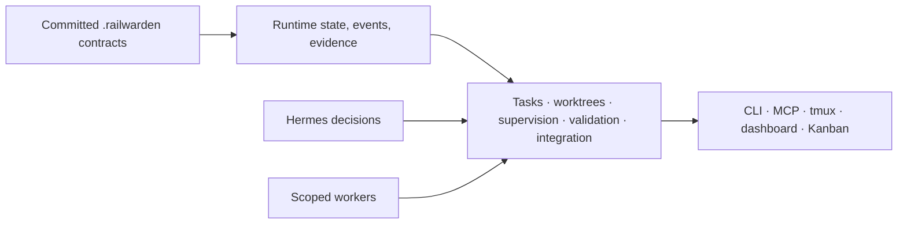

# Architecture

RailWarden is an execution-control kernel with supporting adapters and views. Its source of truth is committed configuration plus ignored, durable runtime state—not a supervisor chat transcript or dashboard.

## Boundary and dependency direction

`config`, `runtime`, `tasks`, `scheduler`, `provisioning`, `processes`, `validation`, and `integration` form the kernel. They may depend on models, Git utilities, and atomic storage, but not on Hermes presentation. Hermes, provider adapters, tmux, Kanban, dashboards, planning helpers, skills, CLI, and MCP are supporting surfaces that call into the kernel.

## Module map and state locations

- `config/`: configuration and work-package loading.
- `runtime/` and `tasks/`: state, events, checkpoints, handoffs, decisions, secrets.
- `scheduler/`: DAG validation, readiness, and assignments.
- `provisioning/`: Git worktree lifecycle.
- `processes/` and `providers/`: adapter/process health and supervision.
- `validation/` and `integration/`: evidence, review, merge and rollback gates.
- `hermes/`: recommended supervisor integration and projection.
- `.railwarden/`: committed contracts; `.railwarden-runtime/`: ignored ledger/evidence; `.railwarden-worktrees/`: ignored scoped workspaces.

## Lifecycles

Task flow is planned → ready → assigned/running → validating → review/merge ready → integrating → merged, with failure paths to handoff, cooldown, decision-required, blocked, rejected, or failed. The controller writes events for each material transition. Recovery records a checkpoint or handoff before reassignment where possible. Integration serializes merges, runs validation, writes evidence, and rolls back a failed post-merge validation.

Hermes has authority to interpret goals, prepare plans, select assignments, diagnose failures, and ask humans. RailWarden has authority over recorded facts, path and worktree mechanics, validation, and merge gates. A worker has no authority to certify its own completion.

Future possibility: supervisor generalization is not a current product contract.
