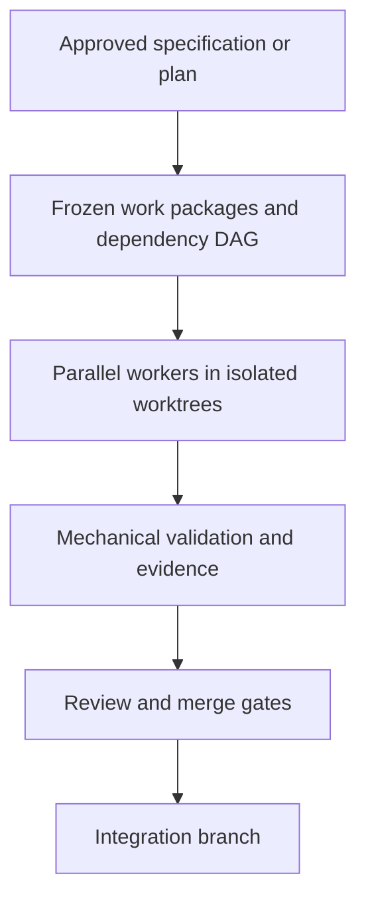
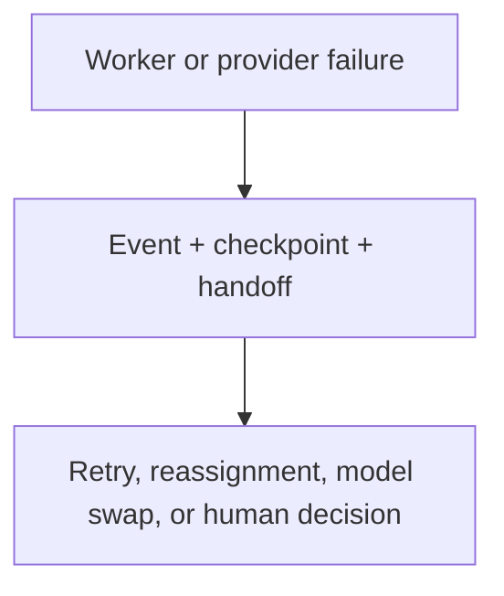
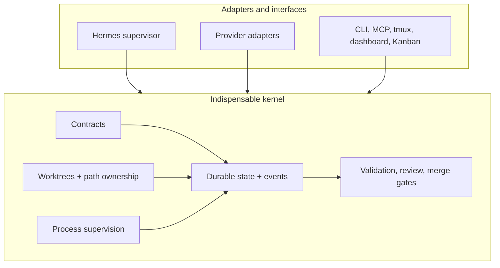

# RailWarden

[](https://github.com/advaith-1212/railwarden/actions/workflows/ci.yml)
[](LICENSE)
[](pyproject.toml)

RailWarden is a deterministic execution and integration control plane for multi-agent software development.

It turns approved plans into isolated work packages, supervises coding agents across Git worktrees, records validation evidence, and permits integration only after mechanical gates pass.

## The problem

Complex software work needs more than an agent claiming it is done. Agent chat history loses context; provider processes can crash, fail authentication, or exhaust quota; result data can be malformed; and unrestricted concurrent edits create dirty worktrees and conflicting changes. Prompts and skill frameworks help an agent reason, but they do not own durable facts. Task managers can track intent, but generally cannot prove commits, validate ownership, or block an unsafe merge. Ordinary CI validates a branch after the fact; it does not supervise the work package, preserve recovery state, or decide whether an agent’s report is credible.

RailWarden owns execution facts: approved work-package contracts, dependency state, isolated worktrees, worker process facts, validation evidence, checkpoints, events, review readiness, and integration decisions. A task is complete only when its scoped changes are committed, mechanically validated, pass the applicable review and merge gates, and are integrated—not when a worker self-certifies.

## What RailWarden guarantees today

The implemented runtime provides durable file-backed execution state, dependency-aware packages, isolated Git worktrees, allowed/forbidden-path checks, supervised provider processes, structured worker-result normalization, validation evidence, checkpoints, append-only event logs, quota-aware handoffs, recovery paths, integration gates, and secret redaction in persisted runtime artifacts. Runtime state is independent of agent chat history.

These are controlled-repository mechanisms, not an absolute safety or production-safety promise. See [evidence](docs/evidence.md), [contracts](docs/contracts/README.md), and [safe adoption](docs/safety.md) for the verification boundary. Future goals are explicitly separated in [architecture](ARCHITECTURE.md).

## Who should use it

### Use RailWarden when

- Multiple coding agents work concurrently across packages, branches, or ownership boundaries.
- Provider failure, handoff, recovery, auditability, validation evidence, and merge gates matter.
- Work must survive restarts and run in isolated Git worktrees.
- Several providers or harnesses participate in a controlled repository workflow.

### Do not use RailWarden when

- One developer or one agent can safely finish a small change in a single session.
- A feature branch plus ordinary CI is sufficient.
- The operational complexity outweighs the benefit, or the repository cannot tolerate generated runtime state and worktrees.

RailWarden is for serious multi-agent workflows, not every coding task.

## How it works





## Quick start

After publication, the supported public install paths are:

```bash
uvx railwarden --help
# or
pipx install railwarden
warden --help
```

From a disposable repository, run the credential-free deterministic demo. `scripted-fake` is demo/test infrastructure only; it is not a production provider adapter.

```bash
mkdir railwarden-demo
cd railwarden-demo
git init -b main
git config user.name demo
git config user.email demo@example.invalid
warden init --demo
warden demo run
```

The demo creates a frozen two-package dependency DAG and isolated worktrees, makes two commits, records an intentional validation failure and handoff, retries, validates, integrates, writes `.railwarden-runtime/reports/demo-acceptance.json`, and safely removes its generated worktrees. It needs no provider credentials. See [acceptance testing](docs/acceptance-testing.md).

## Hermes and workers

```text
RailWarden = deterministic state and mechanics
Hermes     = supervisor and decision-maker
Workers    = scoped implementers
```

Hermes is the currently supported and recommended supervisor. RailWarden owns durable facts and execution mechanics; Hermes owns interpretation, planning, assignment, diagnosis, and orchestration decisions; workers own scoped implementation. Hermes is intentionally retained. RailWarden does not currently promise interchangeable supervisors. A generic supervisor contract is only a future design direction if another ecosystem demonstrates maturity, adoption, trust, and compatibility.

## Comparison

| Capability | Prompt/skill frameworks | Task managers | RailWarden |
| --- | --- | --- | --- |
| Specification approval | Common | Sometimes | Yes |
| Dependency-aware tasks | Sometimes | Common | Yes |
| Dedicated Git worktrees | Sometimes | Limited | Yes |
| Provider process supervision | Rare | Limited | Yes |
| Durable execution ledger | Rare | Partial | Yes |
| Path ownership enforcement | Rare | Rare | Yes |
| Validation evidence | Process-based | Partial | Mechanical |
| Crash recovery | Limited | Limited | Yes |
| Agent handoff state | Limited | Sometimes | Yes |
| Merge gates | Advisory | Limited | Enforced |

These are broad categories; individual tools vary.

## Status

RailWarden is actively evolving and ready for developers to evaluate, extend, and use in controlled repositories.

The core runtime is functional and appropriate for controlled evaluation. Important repositories should use protected branches, backups, required CI, restricted path ownership, and human review. Provider compatibility varies by environment.

## Architecture and product boundary

The core kernel is machine-readable contracts, the durable state machine, dependency/task state, worktree creation, path ownership, process supervision, event recording, structured results, validation evidence, review gates, and integration/merge gates. Supporting surfaces are tmux presentation, dashboards/Kanban projections, adapters, quota UI, context templates, planning helpers, skills, MCP transport, and observability views.



Read [ARCHITECTURE.md](ARCHITECTURE.md) for module boundaries, data flow, and lifecycle detail.

## Documentation

- [Development](DEVELOPMENT.md) · [Contributing](CONTRIBUTING.md) · [Testing](docs/testing.md)
- [Provider adapters](docs/provider-adapters.md) · [CLI development](docs/cli-development.md)
- [Contracts](docs/contracts/README.md) · [Compatibility](docs/compatibility-policy.md) · [Release process](docs/release-process.md)
- [Evidence](docs/evidence.md) · [Safe adoption](docs/safety.md) · [Governance](docs/governance.md)

## License

MIT. See [LICENSE](LICENSE).
